### Project information

- Aplication Name: Music Subscription Service
- Aplication Version: 1.0.0
- Description: A service that allows users to subscribe to different music plans, track revenue, and manage subscriptions.

    - Backend: Spring Boot
    - Database: PostgreSQL
    - Deployment: LocalHost

## Dependencies

| ID | Description  |
|----|--------------|
| 1  | SQL Server   |

##  Entry Points

| ID   | Name                 | Description                                                                    | Trust Levels                                                                                                                                          |
|------|----------------------|--------------------------------------------------------------------------------|-------------------------------------------------------------------------------------------------------------------------------------------------------|
| 1    | HTTP/HTTPS           | All API traffic enters via HTTPS; provides secure transport for all endpoints. | (1) Anonymous User (2) Authenticate User (3) Subscriber (4) Project Manager (5) Financial Director (6) Marketing Director (7) Admin |
| 1.1  | /api/public/login    | Accepts user credentials and returns a signed JWT token.                       | (1) Anonymous User                                                                                                                                    |
| 1.2  | /api/user/account    | Creates a new user account.                                                    | (1) Anonymous User                                                                                                                                    |
| 1.3  | /api/plans           | Publicly exposes available subscription plans.                                 | (1) Anonymous User (3) Subscriber                                                                                                                  |
| 1.4  | /api/plans/*         | Allows creation, update, deactivation, and promotion of plans.                 | (6) Marketing Director (7) Admin                                                                                                                   |
| 1.5  | /api/subscriptions/* | Allows users to subscribe, cancel, switch, or renew their plan.                | (3) Subscriber                                                                                                                                        |
| 1.6  | /api/dashboard/*     | Returns metrics like churn rate, new users, and cancellations.                 | (4) Project Manager (5) Financial Director                                                                                                         |
| 1.8  | /api/devices         | Allows users to manage devices (add, remove, edit, list).                      | (3) Subscriber                                                                                                                                        |
| 1.9  | /api/user/photo      | Allows users to upload their profile picture.                                  | (3) Subscriber                                                                                                                                        |

## Exit Points

| ID  | Name               | Description                                                                                       |
|-----|--------------------|---------------------------------------------------------------------------------------------------|
| 1   | HTTP Response      | Sending responses to users' requests, including HTML pages, JSON data, or file downloads.         |
| 2   | Database Responses | Sending results of database queries back to the application for display or processing.            |
| 3   | Logs               | Logging information including error logs, access logs, or audit logs for monitoring and analysis. |
| 4   | API Responses      | Sending responses from API endpoints to client applications or services.                          |
| 5   | Redirects          | Redirecting users to other pages or URLs within the application or to external sites.             |
| 7   | Notifications      | Sending notifications to users via email, SMS, or in-app messages.                                |

##  Assets

| ID   | Asset                  | Description                                                     |
|------|------------------------|-----------------------------------------------------------------|
| A1   | User Login Credentials | Username/password (stored securely), used for JWT generation.   |
| A2   | JWT Token              | Authenticates users and their roles in API calls.               |
| A3   | Subscription Data      | Info about user subscriptions, plan types, dates.               |
| A4   | Plan Metadata          | Admin-defined plans, promotions, and pricing.                   |
| A5   | User Profile           | Includes uploaded images, preferences, and device list.         |
| A6   | Uploaded Images        | Profile and device images uploaded by users.                    |
| A7   | Dashboard Metrics      | Business data like revenue, churn, and active subs.             |
| A8   | Device List            | Devices linked to user accounts.                                |
| A9   | Cash Flow Reports      | Predictive analytics of future revenue.                         |
| A10  | System APIs            | REST endpoints exposed for frontend to consume.                 |       

## Trust Levels

| ID | Name               | Description                                                                       |
|----|--------------------|-----------------------------------------------------------------------------------|
| 1  | Anonymous User     | A user who has connected to the website but has not provided valid credentials.   |
| 2  | Authenticate User  | A user who has provided valid credentials and is recognized by the system.        |
| 3  | Subscriber         | A user who can subscribe to plans and access content based on their subscription. |
| 4  | Project Manager    | Oversees project progress; has access to project dashboard and analytics.         |
| 5  | Financial Director | Manages financial aspects; can view revenue and financial dashboards.             |
| 6  | Marketing Director | Manages marketing and plan strategies; can create, update, and promote plans.     |
| 7  | Admin              | Handles user administration and system configuration (commented in code).         |

## Data Flow Diagram

### 

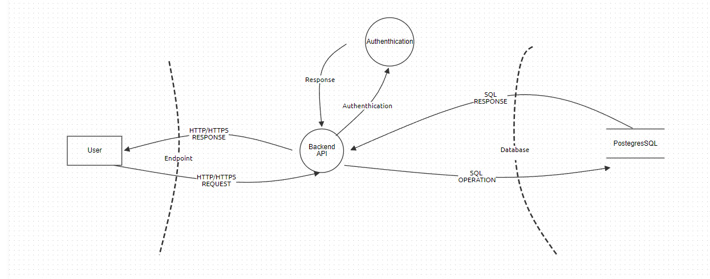

### User Login

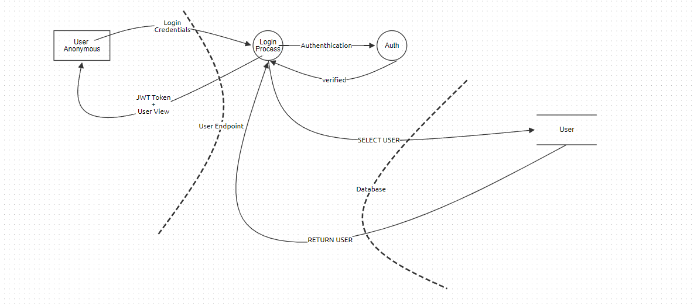

### User Account Creation

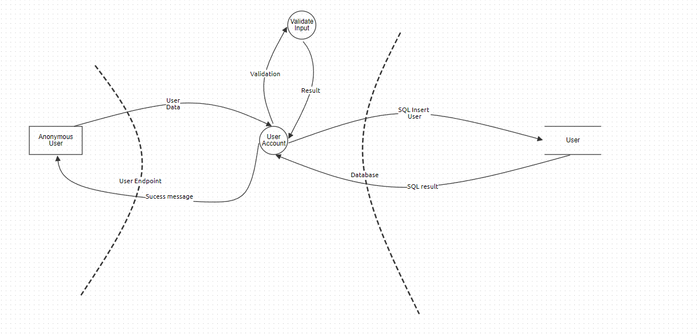

### User Upload File

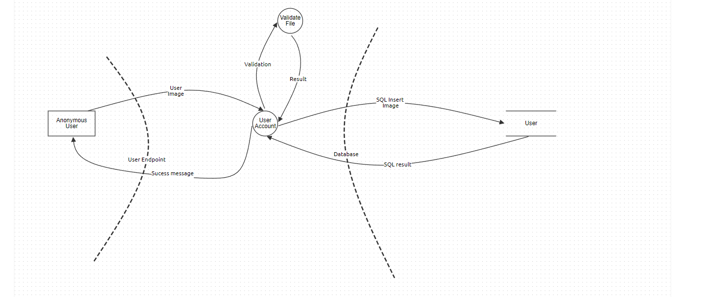

### Subscriptions

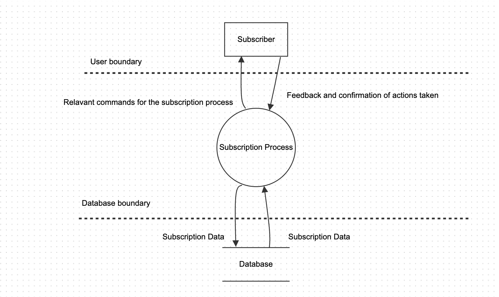

### Plans

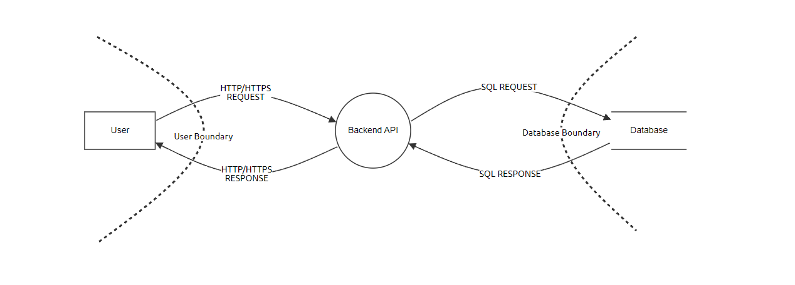

### Dashboard

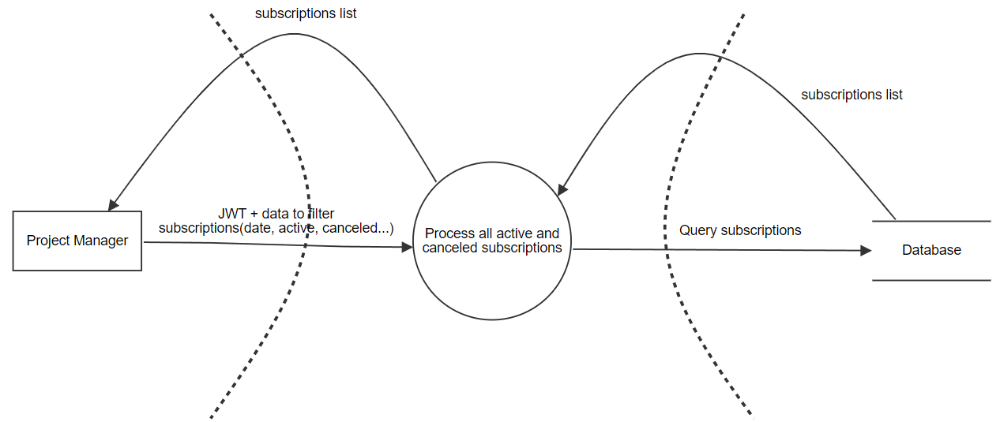

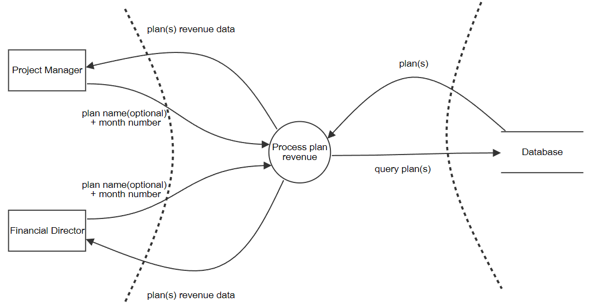

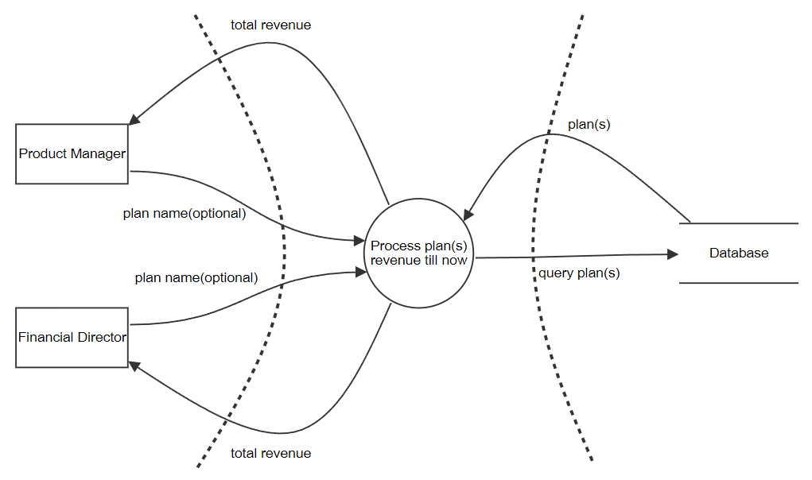

### Device

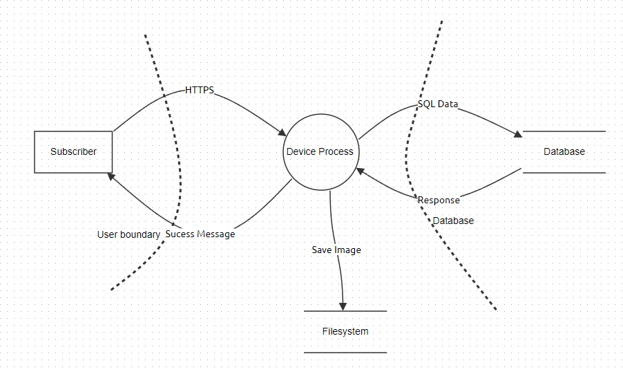

## Threat Tree Analysis

###  User Authentication

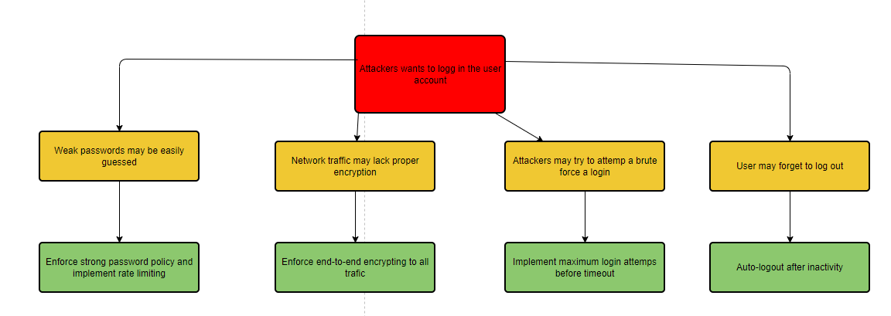

### User Upload File

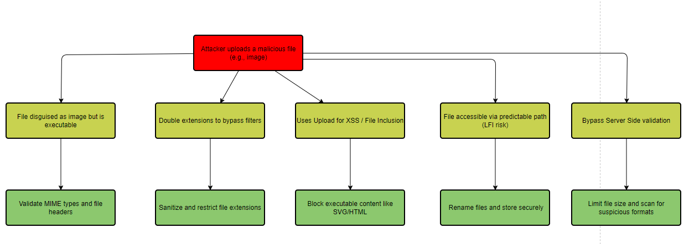

### User Account Creation

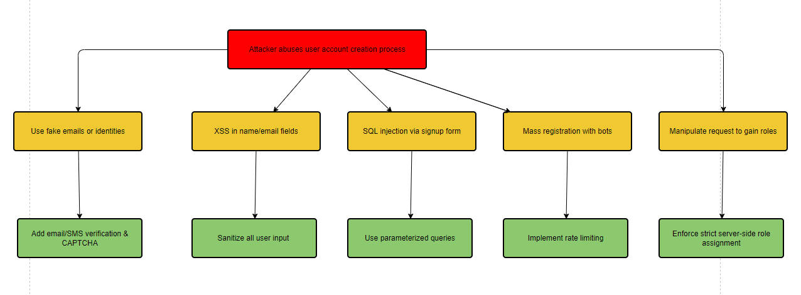

### Subscriptions

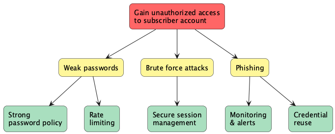

### Plans

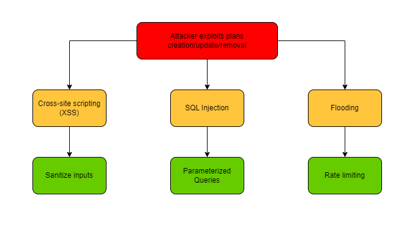

### Dashboard

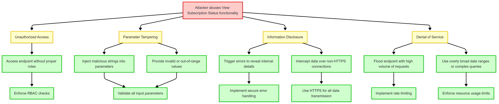

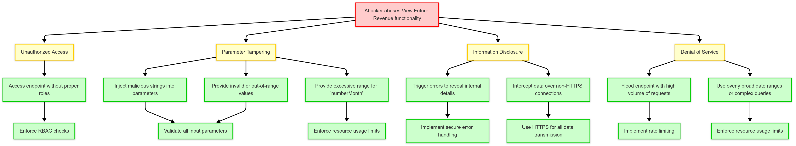

#### Justification for Omission of View Current Year-to-Date Revenue Attack Tree

The attack tree for the "View Current Year-to-Date Revenue" feature has been omitted because it is identical to the "View Subscription Status" attack tree. Both features share the same abuse cases and countermeasures. As a result, duplicating the attack tree would not provide additional insights or value to the threat modeling process.

### Devices Creation or Update

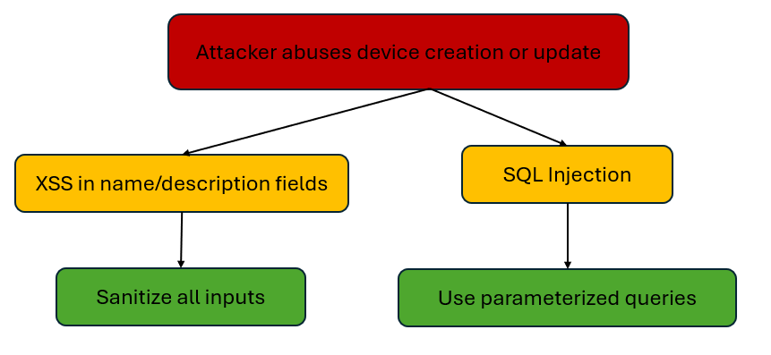

### Device Upload Image

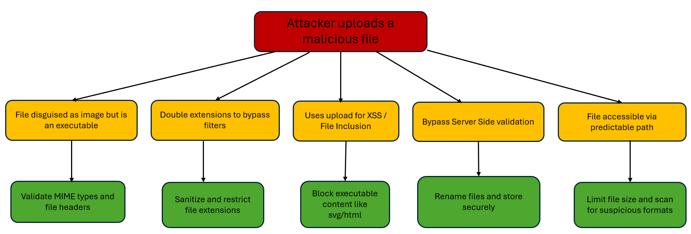

### References

https://owasp.org/www-community/Threat_Modeling_Process#step-2-determine-threats