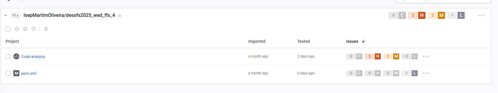

# Phase 1 Analysis
# Introduction

Considering the growing complexity of attacks and the frequent disclosure of sensitive data, security is becoming a crucial necessity in software engineering application development. Following  the Secure Software Development Life Cycle (SSDLC) paradigm, the project created as part of the Master of Computer Engineering program's Secure Software Development (DESOFS) course aims to methodically implement security techniques at every level of the development life cycle.

The goal of this project is to provide a digital platform for music subscription plans that will benefit system administrators as well as end users. With the help of a relational database and a REST API, the program provides features including subscription management, usage analytics, and device administration.

The project's first phase focuses on the analysis and secure solution design. During this phase, functional and non-functional requirements, specific security requirements, and potential abuses that could compromise the system's integrity or confidentiality were identified.

# Project Overview

The selected project consists of the development of a **backend system for managing music subscription plans**. This platform is designed to provide essential services for handling user subscriptions, device associations, and usage metrics, all through a secure and well-structured **RESTful API**.

The system allows users to subscribe to different music plans, manage their active subscriptions, and link multiple devices to their accounts. Additionally, it offers administrative functionalities, enabling system administrators to manage users, monitor subscription data, and access relevant business metrics.

#### Key Features
- **User Management**: Handling user registration, authentication, and role-based access control, supporting multiple roles such as standard users, premium users, and administrators.
- **Subscription Management**: Enabling users to subscribe, modify, or cancel music plans, with full tracking of subscription status and history.
- **Device Association**: Allowing users to register and manage devices authorized to access their music subscription.
- **Usage Metrics**: Collecting and providing access to system usage statistics to support administrative decision-making.
- **Backend Operations**: Performing specific server-side tasks such as file handling and directory management when necessary.

The system architecture is based on a **REST API** connected to a **relational database**, ensuring data persistence and scalability. Designed without a frontend, the platform is intended to be integrated with external clients or user interfaces, acting purely as a service provider.

 

[Archithecture Analasys](./docs/ArchithectureAnalysis.md)

[Threat Modeling](./ssdlc/ThreatModeling.md)

[Stride](./ssdlc/STRIDE.md)

[Abuse Cases](./ssdlc/Abuse_Case.md)

[ASVS](./asvs/asvs.md)

# Phase 2 Analysis
# Changes Made
The project has undergone significant changes to enhance its security posture and usability. The following sections outline the key areas of improvement, including architecture, design, authentication, error handling, logging, and communication protocols.
First it was noticed that there was a extensive vulnerability in the system dependencies, which were updated to the latest versions to mitigate known security issues. This included updating libraries and frameworks to their latest stable releases, ensuring that the system is protected against vulnerabilities that have been addressed in newer versions.
This is the current state of the vulnerabilities in the system dependencies:

In the image there are  4 issues in the  code analysis, related with CORS , in which we ignored because there is no frontend in the system, so there is no risk of CORS attacks.
Ther were also defined the Test Plan and the threat Hirearchy, which where not defined in Phase 1.

[Test Plan](./ssdlc/TestPlan.md)

[Threat Hierarchy](./ssdlc/DREAD.md)
# Workflow
To address the Project requirements of using pipelines for SAST, DAST, SCA and IAST. It was developed several pipelines that automate the security testing process, ensuring that the code is continuously monitored for vulnerabilities and compliance with security standards. The pipelines include:
 
- **Build and Test Pipeline**: This pipeline automates the build and test process, ensuring that the code is compiled and tested before deployment. It includes steps for compiling the code, running unit tests, and generating test reports this is possible using a SAST tool like Sonarquebe.
- **Security Scanning Pipeline**: This pipeline integrates security scanning tools to identify vulnerabilities in the codebase. It includes steps for running static analysis tools, dependency checks, and vulnerability scans. The results are reported and can be used to track and remediate security issues it was used tools like Snyk, Gitleaks, OWASP Dependecy Check this pipeline uses SCA tools.
- **Build and Deploy Pipeline**: This pipeline automates the deployment process, ensuring that the code is deployed to the production environment securely. It includes steps for building the application, running security checks, and deploying to the target environment.
- **DAST Pipeline**: This pipeline focuses on dynamic application security testing, running tests against the deployed application to identify runtime vulnerabilities. It includes steps for configuring the testing environment, running DAST tools, and generating reports on identified issues.

No IAST pipelene was implemented, because no free solution was found that could be used in the project, and the project does not have a frontend, so it was not necessary to implement IAST testing.

  [Github Workflow](./ssdlc/pipeline/Workflow.md)

# Requirements Implemented

## Architecture,Design and Threat 

## Authentication

The system now takes a more flexible, user-friendly approach to passwords: instead of enforcing complex regex patterns, you only need to pick a password between 12 and 24 characters. That way, you still get a strong, secure password without wrestling with rules that are hard to remember.

 Whenever you want to change your password, just call a dedicated endpoint, enter your current password to verify it’s you, and choose a new one. The entire process uses the same BCrypt encryption standards, so no one can swap out your password without your permission—keeping your account safe and sound.

## Error Handling and Logging 

The system implements a **security-first error handling strategy** that prioritizes information disclosure prevention while maintaining reliability, featuring generic error messages to external clients that prevent sensitive data leakage, detailed internal logging for security monitoring, and consistent error response formats across all API endpoints. 

The error handling covers authentication failures with uniform responses to prevent username enumeration, business logic errors that mask internal system details, database errors with SQL injection protection through parameterized queries, and concurrent access errors with optimistic locking and version control, ensuring that all error responses maintain security while providing appropriate feedback for legitimate users and comprehensive audit trails for security analysis.

### Security Implementation Features

#### Information Security Protection
- **Generic Error Responses**: All client-facing errors use standardized messages that prevent system architecture disclosure and sensitive information leakage
- **Detailed Internal Logging**: Comprehensive security event logging for monitoring, incident response, and audit trail maintenance
- **Database Schema Protection**: SQL exceptions are masked and converted to generic responses, preventing database structure disclosure

# Communication

The system implements comprehensive security measures to ensure secure communication and data protection across all API endpoints. **HTTPS enforcement** is mandatory for all data transmission, preventing man-in-the-middle attacks and ensuring encrypted communication channels. 

The platform utilizes **JWT-based authentication** with secure token management, implementing proper signing algorithms and appropriate expiration times for stateless authentication. 

**Input validation** is rigorously applied to all user inputs including payment type validation against regex patterns (annually|monthly), parameter sanitization to prevent injection attacks, and version number validation for concurrent access control. 

The error handling strategy prioritizes **information disclosure prevention** with generic error messages that prevent system architecture exposure, database schema protection through masked SQL exceptions, and consistent error response formats across all endpoints, ensuring secure communication while maintaining system reliability and user experience.

