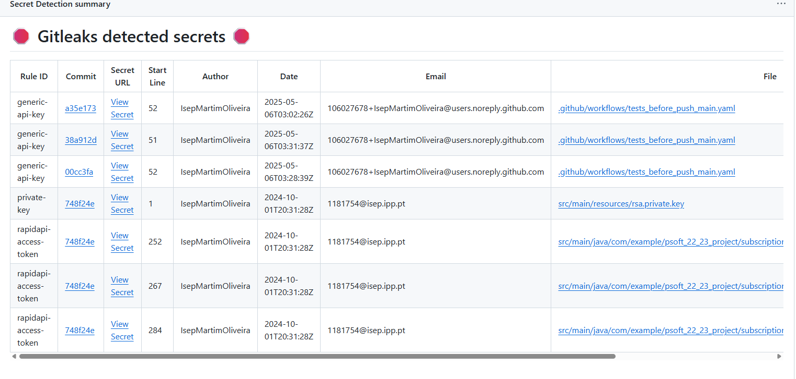
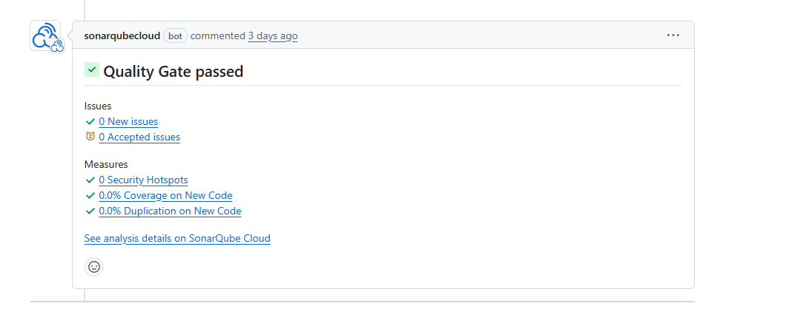

# GitHub Actions Workflow
# Build and Push Docker Image on Release


This is a **GitHub Actions workflow** that runs automatically **when a new release is published** in the repository, it is designed to:

- Build your Java project.
- Package it into a Docker image.
- Scan the image for security issues.
- Push the verified image to **Docker Hub**.

It helps automate the release process and ensures your Docker images are **secure and production-ready**.


### What does it consist of?

This workflow is made up of the following key steps:

### Checkout Code
```yaml
- uses: actions/checkout@v4
```
Fetches  repository code so it can be built.


### Set Up Java
```yaml
- uses: actions/setup-java@v4
```
Installs Java 17 (Temurin) and prepares the Maven environment to build the project.


### Build JAR
```yaml
- run: mvn clean package -DskipTests
```
Compiles the Java application and creates a `.jar` file.


### Set Up Docker Build
```yaml
- uses: docker/setup-buildx-action@v3
```
Enables  Docker image building capabilities.


### Login to Docker Hub
```yaml
- uses: docker/login-action@v3
```
Logs into Docker Hub using your stored credentials so the image can be pushed later.


### Build Docker Image (Locally)
```yaml
- uses: docker/build-push-action@v6
  push: false
  load: true
```
Builds the Docker image but **does not push it yet**, this image is used for scanning.


### Scan with Trivy
```yaml
- uses: aquasecurity/trivy-action@master
```
Scans the Docker image for **critical** and **high** vulnerabilities in OS packages and dependencies.


### Scan with Docker Scout
```yaml
- uses: docker/scout-action@v1
```
Performs an additional security scan focused on known CVEs (critical/high only).


### Build and Push Docker Image
```yaml
- uses: docker/build-push-action@v6
  push: true
```
If the scans pass, the image is **built again and pushed to Docker Hub** with two tags:
- `latest`
- the release version (e.g:`v1.0.0`)


## Required Secrets

Make sure your repository includes the following secrets:

- `DOCKER_USERNAME`: Your Docker Hub username.
- `DOCKER_PASSWORD`: Your Docker Hub password or access token.


## Example Workflow Result


# Security Scans Workflow


This is a **GitHub Actions workflow** that automatically runs **secret detection** and **vulnerability scans**, it is triggered on:

- Pushes to the `main` branch
- Pull requests targeting `main`
- A **weekly schedule** (every Sunday at midnight UTC)
- Manual runs via **workflow_dispatch**

This helps ensure the  project stays secure by catching leaked secrets or risky dependencies early.


## What does it do?

This workflow runs two main jobs:


## Secret Detection (`secret-scanning`)

This job scans your entire Git history for exposed secrets (API keys, credentials, tokens, etc.).

### Steps:

### Checkout code
```yaml
- uses: actions/checkout@v4.2.2
  with:
    fetch-depth: 0  # full history for deeper scan
```

### Run GitLeaks
```yaml
- uses: gitleaks/gitleaks-action@v2
```
Uses GitLeaks to detect secrets, It continues even if it finds issues so the report can be uploaded.

###  Upload GitLeaks Report
```yaml
- uses: actions/upload-artifact@v4
```
Saves the results as artifacts:
- `gitleaks-report.json`
- `gitleaks-report.sarif`


##  Dependency Vulnerability Scanning (`dependency-scanning`)

This job scans your project’s **Maven dependencies** for known vulnerabilities using OWASP tools.

###  Steps:

### Checkout code
```yaml
- uses: actions/checkout@v4.2.2
```

### Cache Maven dependencies
```yaml
- uses: actions/cache@v4
```
Speeds up build time by reusing downloaded dependencies.

###  Set up JDK 17
```yaml
- uses: actions/setup-java@v4.7.1
```
Ensures the Java environment is correctly configured.

###  Set `JAVA_HOME` (optional)
```yaml
- run: echo "JAVA_HOME=..."
```
Ensures Java tools use the correct version.

### Make `mvnw` executable

 chmod +x ./mvnw


### OWASP Dependency-Check
```yaml
- uses: dependency-check/Dependency-Check_Action@main
```
Scans all dependencies and flags anything with a CVSS score ≥ 7.0 (high risk), output is in HTML format.

### Upload Dependency Check Report
```yaml
- uses: actions/upload-artifact@v4
```
Saves the scan result (`reports`) for download and manual inspection.

---

## Required Secrets

To use this workflow securely, add the following secrets in your GitHub repo:

- `GITHUB_TOKEN`: Auto-provided by GitHub for authentication.
- `GITLEAKS_LICENSE`: F 24or using GitLeaks with a license.
- `SNYK_TOKEN`: If you want to enable Snyk scanning (commented out in the file).

---

##  Why use this?

- Automated security checks with every commit or PR
- Detect secrets before they get leaked
- Find vulnerable libraries before they go to production
- Generate detailed scan reports for auditing

## Example Workflow Result




# SonarQube analysis


This GitHub Actions workflow automates the process of building, testing, and analyzing a Java project using **Maven** and **SonarQube**.

It runs on:
- Pushes to the `main` branch
- Pull requests targeting `main`

The goal is to enforce **code quality**, run tests, and integrate **SonarQube analysis** into the CI process.


##  Steps


### Checkout code
```yaml
- uses: actions/checkout@v4.2.2
```
Fetches the full codebase history (`fetch-depth: 0`) to enable branch and pull request analysis by SonarQube.


###  Set up JDK 17
```yaml
- uses: actions/setup-java@v4.7.1
```
Ensures that Java 17 is available and caches Maven dependencies to speed up builds.


### Cache SonarQube artifacts
```yaml
- uses: actions/cache@v4.2.3
```
Caches downloaded SonarQube scanner files to reduce repeated downloads and speed up future runs.


### Cache Maven packages
```yaml
- uses: actions/cache@v4
```
Caches Maven dependencies stored in `~/.m2`.


### Build and analyze with SonarQube
```yaml
- run: mvn -B verify org.sonarsource.scanner.maven:sonar-maven-plugin:sonar
```
Performs the following:
- Builds the project and runs unit tests.
- Triggers **SonarQube analysis** with the Maven plugin.
- Waits for the **Quality Gate** result (`-Dsonar.qualitygate.wait=true`).


## Required Secrets

To run this workflow successfully, the following **GitHub repository secrets** must be configured:

- `SONAR_TOKEN`: Authentication token for SonarQube (create from your SonarQube account).
- `SONAR_ORGANIZATION`: SonarQube project key or organization identifier.


 ## Benefits

-  Automated build and quality control for Java projects
-  Continuous inspection of code via SonarQube
-  Ensures broken builds and low-quality code are caught before merging

## Example Workflow Result



