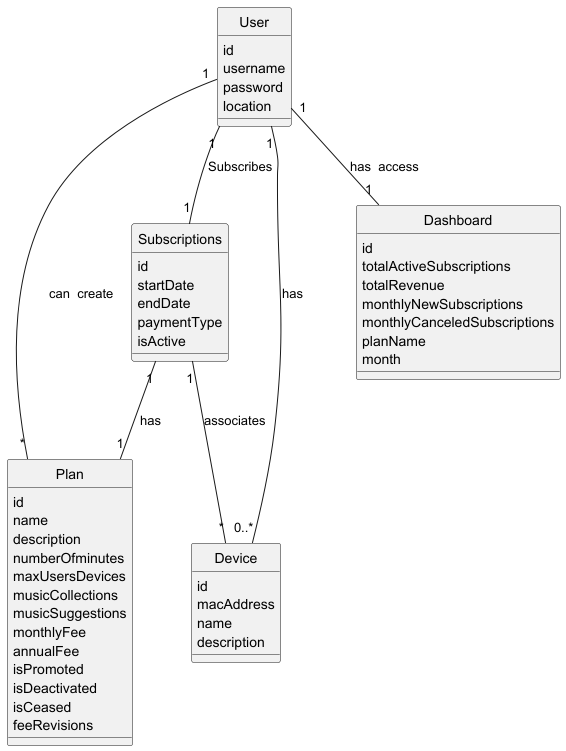
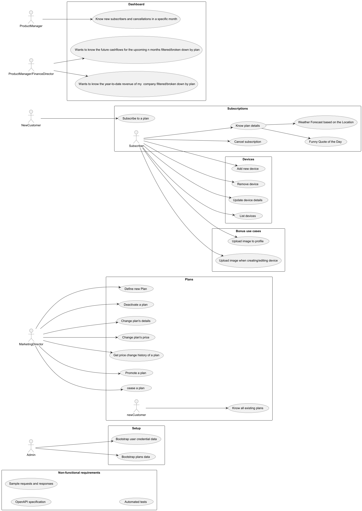
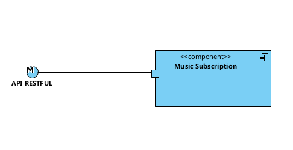
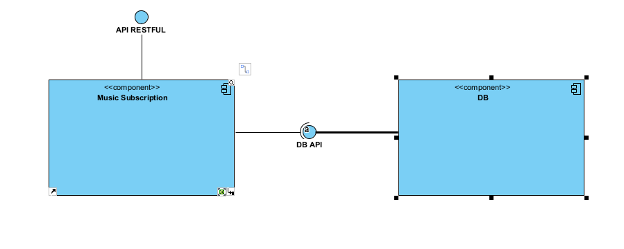
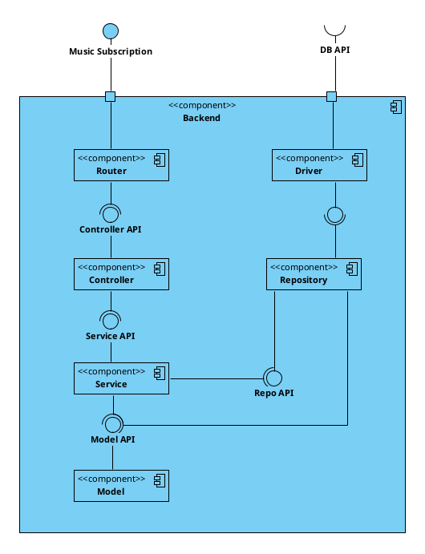
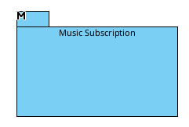
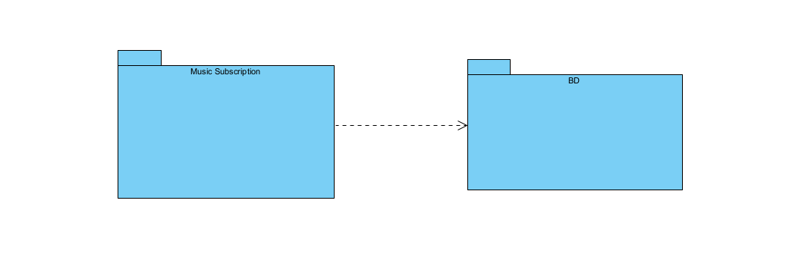
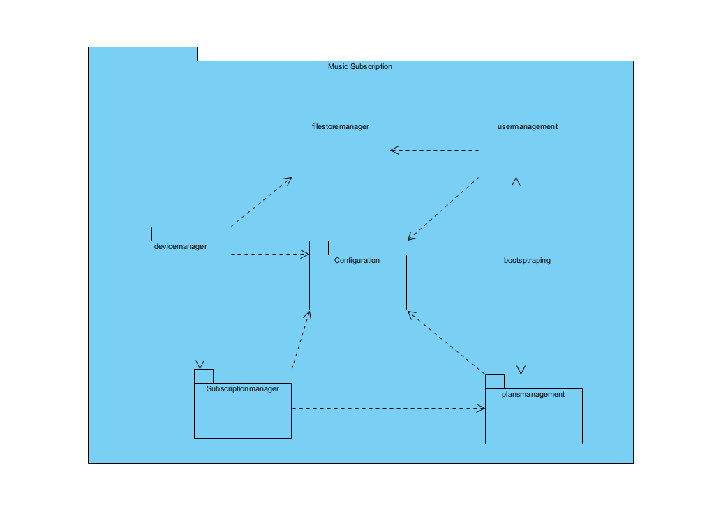
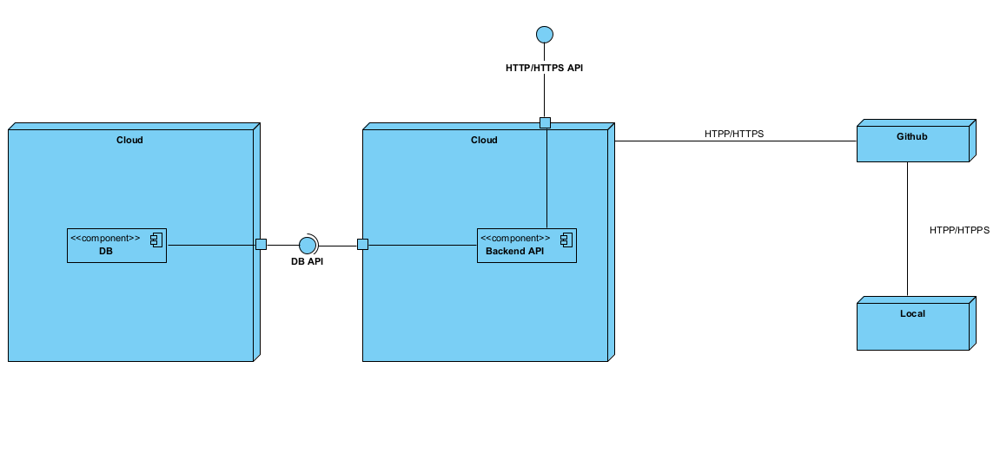

# Architectural Analysis 

## Domain Model

## Use Case Diagram

## Functional Requirements

1. Admin can bootstrap user credential data.
2. Admin can bootstrap subscription plan data.
3. Marketing director can define a new subscription plan, including monthly/annual cost, device limit, and other features.
4. Marketing director can deactivate a subscription plan.
5. Marketing director can change plan details (excluding pricing).
6. Customer can view all available subscription plans.
7. Customer can subscribe to a plan.
8. Subscriber can cancel their subscription.
9. Subscriber can view the details of their subscription plan.
10. Product Manager can view the number of new subscriptions and cancellations for a specific month.
11. Subscriber can add a new device to their account.
12. Subscriber can remove a device from their account.
13. Subscriber can update a device’s details (name and description).
14. Subscriber can list all registered devices.
15. Subscriber can upload a profile image.
16. Subscriber can upload an image when adding or editing a device.
17. Marketing director can promote a subscription plan.
18. Marketing director can cease a subscription plan (only if it has no active subscribers).
19. Subscriber can switch their plan (upgrade or downgrade).
20. Subscriber can renew an annual subscription.
21. Marketing director can migrate all subscribers from one plan to another.
22. Product Manager or Financial Director can view future cash flows for the upcoming months, filtered by plan.
23. Product Manager or Financial Director can view year-to-date revenue, filtered by plan.
24. Marketing director can change the pricing of a plan.
25. Marketing director can view the price change history of a plan.

## Non-Functional Requirements
1. The system must provide an OpenAPI specification.
2. All authenticated API requests must use JWT (JSON Web Tokens).
3. Long result lists must support pagination.
4. Concurrent access must be handled properly.

## Security Requirements

### General Requirements

1. All endpoints must enforce authentication and validate roles via RBAC.
2. All endpoints must validate input data.
3. All endpoints must use HTTPS.
4. All failed login attemps must be logged.
5. Necessary endpoints must implement rate limiting.
6. Store passwords using strong hashing algorithms.
7. Implement JWT with appropriate expiration times.

### User Requirements

1. As  an anonymous user, I can view the available subscription plans.
2. As an authenticated user, I can view my subscription plan details, and should not be able to view other users' subscription details.
3. As an authenticated user, I can view my devices and should not be able to view other users' devices.
4. As an authenticated user, I want my uploaded images to be stored securely and not accessible to others unless intended.
5. As an authenticated user, I want to ensure that the information I submit is stored and displayed accurately.
6. As an authenticated user, I want to be notified if any of my critical data is changed (e.g., email, subscription plan)
7. As an authenticated user, I want a log of my important actions (e.g., plan changes, cancellations) to verify what I’ve done.
8. As an authenticated user, I want to be able to change my password and should not be able to change it.
9. As a marketing director, I want a log of my important actions to verify what I've done.
10. As a marketing director, I want to ensure my information is stored and sent safely.

## Archithecture

## Logic view

### Level 1:

### Level 2:

### Level 3:

## Implementation View

### Level 1:

### Level 2:

### Level 3:

## Deployment View

