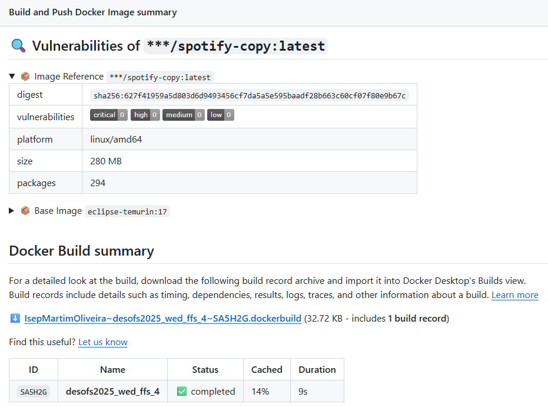
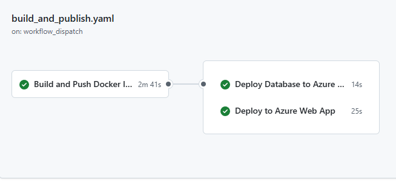
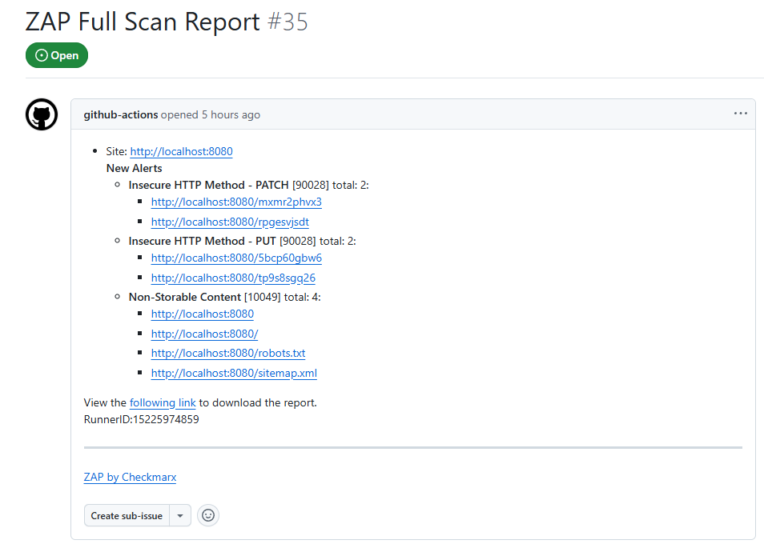
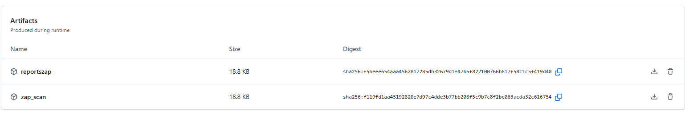

# GitHub Actions Workflow
# Build and Push Docker Image on Release

This workflow automates the process of building a Java application, creating a Docker image, scanning it for vulnerabilities, and deploying it to Azure VMs. It supports both manual and release-triggered executions.

## Workflow Triggers
- **On Release Published**: Automatically triggered when a new GitHub release is published.

### Job: Build and Push Docker Image

### Steps:
1. **Checkout Code**: Fetches the repository code so it can be built.
2. **Set Up Java**: Installs Java 17 (Temurin) and prepares the Maven environment to build the project.
3. **Build JAR**: Compiles the Java application and creates a `.jar` file.
4. **Set Up Docker Build**: Enables Docker image building capabilities.
5. **Login to Docker Hub**: Logs into Docker Hub using your stored credentials so the image can be pushed later.
6. **Build Docker Image (Locally)**: Builds the Docker image but does not push it yet; this image is used for scanning.
7. **Scan with Trivy**: Scans the Docker image for critical and high vulnerabilities in OS packages and dependencies.
8. **Scan with Docker Scout**: Performs an additional security scan focused on known CVEs (critical/high only).
9. **Build and Push Docker Image**: If the scans pass, the image is built again and pushed to Docker Hub with two tags:
   - `latest`
   - the release version (e.g: `v1.0.0`)

## Job: Deploy Database to Azure VM
### Depends On
- `build-and-push`

### Steps

1. **Checkout Code:** Fetches the repository code so it can be built.
2. **Setup SSH Private Key:** Sets up the SSH private key for accessing the Azure VM.
3. **Generate `.env` from Secrets:** Generates a `.env` file containing database connection details and other environment variables from GitHub secrets.
4. **Add Private Key to SSH Agent:** Adds the SSH private key to the SSH agent for secure access to the Azure VM. 
5. **Copy Docker Compose File to Azure VM:** 
    - Copies the `docker-compose-db.yml` file to the Azure VM.
    - This file contains the configuration for the database services.
   6. **Copy and Execute Setup Script:** 
    - Copies the `scripts/setup-java-docker.sh` script to the Azure VM.
    - Executes the script to install Docker and Java on the remote VM.
7. **Transfer `.env` File:**
    - Copies the generated `.env` file to the Azure VM.
    - This file contains sensitive information like database credentials and SSL configuration.
8. **Deploy via SSH**
    - Uses `docker compose` to start services defined in `docker-compose-db.yml`.

## Job: Deploy Backend to Azure Web App

### Depends On
- `build-and-push`

### Steps

1. **Checkout Code:** Fetches the repository code so it can be built.
2. **Setup SSH Private Key:** Sets up the SSH private key for accessing the Azure VM.
3. **Decode and Store SSL Keystore** 
    - Decodes the base64-encoded SSL keystore from GitHub secrets.
    - Saves it as `keystore.p12` in the repository root.
4. **Generate `.env` from Secrets** 
    - Generates a `.env` file containing environment variables from GitHub secrets.
    - This file includes database connection details, SSL configuration, and role credentials.
5. **Add Private Key to SSH Agent** 
    - Adds the SSH private key to the SSH agent for secure access to the Azure VM.
6. **Copy Docker Compose File** 
    - Copies the `docker-compose-prod.yml` file to the Azure VM.
    - This file contains the configuration for the backend services.
7. **Copy and Execute Setup Script** 
    - Copies the `scripts/setup-java-docker.sh` script to the Azure VM.
    - Executes the script to install Docker and Java on the remote VM.
8. **Copy Keystore and `.env` to Azure VM** 
    - Copies the `keystore.p12` file and the generated `.env` file to the Azure VM.
    - These files are essential for SSL configuration and environment variables.
9. **Deploy via SSH**
    - Logs into Docker Hub
    - Pulls latest image
    - Brings up the app with `docker-compose-prod.yml`
##  Required Secrets

| Secret Name              | Purpose                            |
|--------------------------|------------------------------------|
| `DOCKER_USERNAME`        | Docker Hub username                |
| `DOCKER_PASSWORD`        | Docker Hub password                |
| `AZURE_SSH_PRIV_KEY`     | SSH private key for Azure access   |
| `AZURE_SSH_PRIV_DB_KEY`  | SSH key specifically for DB VM     |
| `AZURE_VM_USER`          | Azure VM username                  |
| `AZURE_HOST_DB_VM`       | Hostname/IP for the DB VM          |
| `AZURE_HOST_VM`          | Hostname/IP for backend VM         |
| `DB_NAME`, `DB_USERNAME`, `DB_PASSWORD`, `DB_AZURE_URL` | Database connection configuration |
| `SSL_KEYSTORE`, `SSL_KEYSTORE_PASSWORD` | SSL configuration    |
| `ADMIN_PASS`, `MARKETING_PASS`, `SUBSCRIBER_PASS_1`, `SUBSCRIBER_PASS_2`, `PROJECT_MANAGER`, `FINANCE_PASSWORD` | Role credentials |
| `JWT_PRIVATE_KEY`, `JWT_PUBLIC_KEY` | JWT security keys       |

##  Folder & File Requirements

- `docker-compose-db.yml`: Compose file for database services.
- `docker-compose-prod.yml`: Compose file for backend services.
- `scripts/setup-java-docker.sh`: Shell script to install Docker/Java on the remote VMs.
- `keystore.p12`: SSL keystore (created during the workflow).
- `.env`: Environment variable file generated from secrets.
- `/var/log/myapp`: Directory for application logs (created during the workflow).

# Beenefits
- **Automated Deployment**: Simplifies the process of building, scanning, and deploying applications.
- **Security Scanning**: Integrates vulnerability scanning to ensure the Docker image is secure before deployment.
- **Multi-Environment Support**: Supports both development and production environments with different configurations.

## Example Workflow Result

# DAST OWASP ZAP Scan Workflow Documentation

This GitHub Actions workflow automates a **Dynamic Application Security Testing (DAST)** process using **OWASP ZAP**, It builds and deploys a Dockerized application, runs a full security scan, and uploads the generated reports.

##  Trigger
The workflow is **manually triggered**  when there is a pull request to the main branch

## Steps:
1. Fetches  repository code so it can be built.
2. Installs Java 17 (Temurin) and prepares the Maven environment to build the project.
3. Compiles the Java application and creates a `.jar` file.
4. Decodes the SSL keystore from a base64-encoded secret and saves it as `keystore.p12`.
5. Generates a `.env` file with database and SSL configuration from GitHub secrets.
6. Sets up the database by running a Docker Compose command to start the database service.
7. Builds image of backend
8. Runs backend service using Docker Compose
9. Runs OWASP ZAP scan
10. Uploads ZAP report artifacts

## Required Secrets
| Secret Name              | Purpose                            |
|--------------------------|------------------------------------|
| `DOCKER_USERNAME`        | Docker Hub username                |
| `DOCKER_PASSWORD`        | Docker Hub password                |
| `DB_NAME`, `DB_USERNAME`, `DB_PASSWORD`, `DB_AZURE_URL` | Database connection configuration |
| `SSL_KEYSTORE`, `SSL_KEYSTORE_PASSWORD` | SSL configuration    |
| `ADMIN_PASS`, `MARKETING_PASS`, `SUBSCRIBER_PASS_1`, `SUBSCRIBER_PASS_2`, `PROJECT_MANAGER`, `FINANCE_PASSWORD` | Role credentials |
    
# Folder & File Requirements
- `docker-compose-db-test.yml`: Compose file for database services.
- `docker-compose-test.yml`: Compose file for backend services.
- `keystore.p12`: SSL keystore (created during the workflow).
- `.env`: Environment variable file generated from secrets.
- `zap-scan-report.html`: HTML report generated by OWASP ZAP.
- `zap-scan-report.json`: JSON report generated by OWASP ZAP.
- `zap-scan-report.md`: Markdown report generated by OWASP ZAP.

## Benefits
- **Automated Security Testing**: Regularly scans the application for vulnerabilities without manual intervention.
- **Early Detection**: Catches potential security issues before they reach production.
- **Comprehensive Coverage**: Scans the entire application, including dynamic content and APIs.
- **Artifact Storage**: Keeps scan results for future reference and compliance.
- **Integration with CI/CD**: Seamlessly integrates into the existing CI/CD pipeline, ensuring security is part of the development lifecycle.

## Example Workflow Result

# Security Scans Workflow

This workflow runs automated security scans on a Java Maven project, including secret detection and dependency vulnerability scanning.

## Triggers

- Pushes to the `main` branch
- Pull requests targeting `main`
- A **weekly schedule** (every Sunday at midnight UTC)
- Manual runs via **workflow_dispatch**

This helps ensure the  project stays secure by catching leaked secrets or risky dependencies early.

## Jobs
### Secret Detection (`secret-scanning`)
This job scans your entire Git history for exposed secrets (API keys, credentials, tokens, etc.).
### Steps:
1. **Checkout code**: Fetches the full Git history to ensure all commits are scanned.
2. **Run GitLeaks**: Uses the GitLeaks action to scan for secrets in the codebase.
3. **Upload GitLeaks Report**: Saves the scan results as artifacts for later review.
### Dependency Vulnerability Scanning (`dependency-scanning`)
This job scans your project’s **Maven dependencies** for known vulnerabilities using OWASP tools.
### Steps:
1. **Checkout code**: Fetches the latest code from the repository.
2. **Cache Maven dependencies**: Uses caching to speed up the build process by reusing previously downloaded dependencies.
3. **Set up JDK 17**: Ensures the Java environment is correctly configured for building the project.
4. **Set `JAVA_HOME` (optional)**: Sets the `JAVA_HOME` environment variable to ensure Java tools use the correct version.
5. **Make `mvnw` executable**: Ensures the Maven wrapper script is executable.
6. **Snyk Security Scan**: Runs the Snyk action to scan for vulnerabilities in the project dependencies.
7. **OWASP Dependency-Check**: Runs the OWASP Dependency-Check action to scan all dependencies for vulnerabilities.
8. **Upload Dependency Check Report**: Saves the scan results as artifacts for manual inspection.

## Required Secrets
| Secret Name           | Environment Variable     | Purpose                                              |
|-----------------------|--------------------------|------------------------------------------------------|
| Github Token          | `GITHUB_TOKEN`           | Auto-provided by GitHub for authentication.         |
| GitLeaks License      | `GITLEAKS_LICENSE`       | Required for running licensed GitLeaks scans.       |
| Snyk Token (optional) | `SNYK_TOKEN`             | Used for scanning dependencies with Snyk (if enabled). |

## Benefits
- **Automated Security**: Regularly scans for secrets and vulnerabilities without manual intervention.
- **Early Detection**: Catches potential security issues before they reach production.
- **Comprehensive Coverage**: Scans both code secrets and dependency vulnerabilities.
- **Artifact Storage**: Keeps scan results for future reference and compliance.

## Example Workflow Result

# SonarQube analysis

This GitHub Actions workflow automates the process of building, testing, and analyzing a Java project using **Maven** and **SonarQube**, the goal is to enforce **code quality**, run tests, and integrate **SonarQube analysis** into the CI process.

##  Trigger
The workflow is triggered by:
- Pushes to the `main` branch
- Pull requests targeting `main`

##  Steps
1. **Checkout code**: Fetches the repository code so it can be built.
2. **Set up JDK 17**: Installs Java 17 (Temurin) and prepares the Maven environment to build the project.
3. **Cache SonarQube artifacts**: Caches downloaded SonarQube scanner files to reduce repeated downloads and speed up future runs.
4. **Cache Maven packages**: Caches Maven dependencies stored in `~/.m2` to speed up builds.
5. **Build and analyze with SonarQube**: Runs Maven to build the project, execute tests, and perform SonarQube analysis with the Maven plugin, waiting for the Quality Gate result.

## Required Secrets

To run this workflow successfully, the following **GitHub repository secrets** must be configured:

| Secret Name              | Purpose                            |
|--------------------------|------------------------------------|
| `SONAR_TOKEN`            | SonarQube authentication token     |
| `SONAR_ORGANIZATION`     | SonarQube project key or organization identifier |

 ## Benefits

-  Automated build and quality control for Java projects
-  Continuous inspection of code via SonarQube
-  Ensures broken builds and low-quality code are caught before merging

## Example Workflow Result

